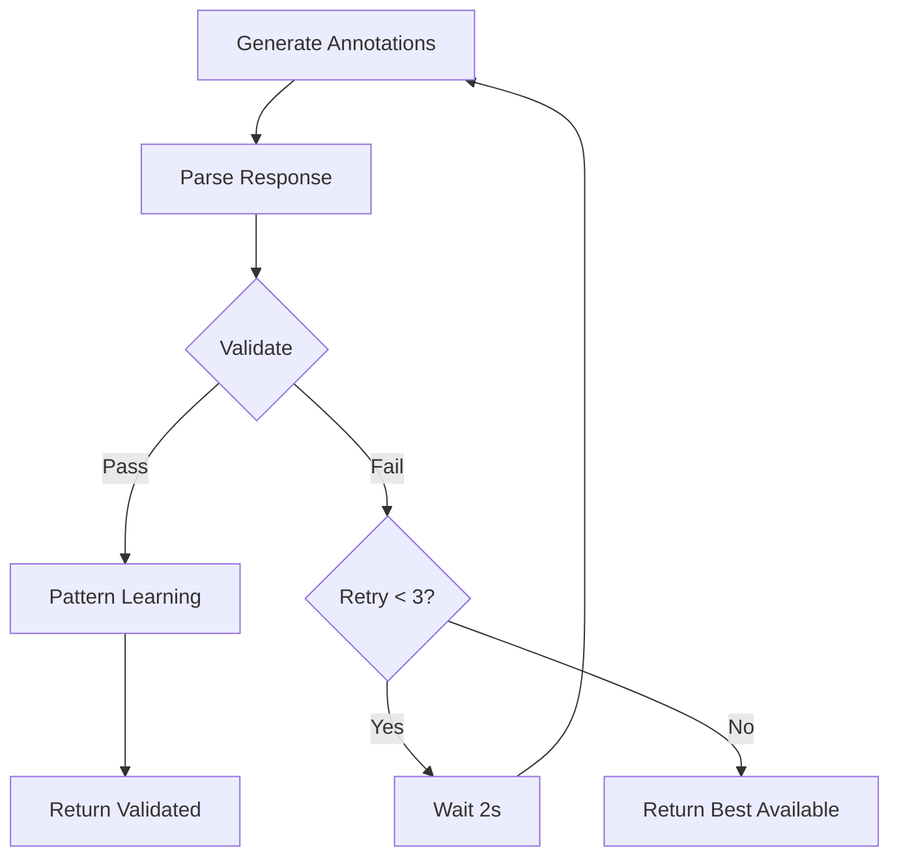

# Annotation Validation - Quick Reference

## Quick Start

```typescript
import { visionAIService } from './services/VisionAIService.integrated';

// Generate with automatic validation and retry
const annotations = await visionAIService.generateAnnotations(
  imageUrl,
  imageId,
  {
    species: 'Northern Cardinal',
    enableValidation: true,    // Quality validation
    enablePatternLearning: true // Learn from patterns
  }
);
```

## Validation Thresholds

| Check | Threshold | Action |
|-------|-----------|--------|
| Confidence | ≥ 0.7 | Reject if lower |
| Bounding Box Size | 1% - 80% | Reject if outside |
| Duplicate Overlap | > 5% IoU | Remove duplicate |
| Min Annotations | ≥ 3 | Retry if fewer |
| Max Annotations | ≤ 15 | Trim to top 15 |

## Retry Logic

```
Attempt 1 → Validate → FAIL
   ↓ (wait 2s)
Attempt 2 → Validate → FAIL
   ↓ (wait 2s)
Attempt 3 → Validate → FAIL
   ↓
Return best available annotations
```

## Common Validation Errors

```typescript
// Low confidence
{
  error: "Low confidence: 0.65 < 0.7",
  action: "Rejected"
}

// Invalid bounding box
{
  error: "Bounding box too small: 0.5% < 1%",
  action: "Rejected"
}

// Duplicate
{
  error: "Duplicate detected (65% overlap)",
  action: "Removed (kept higher confidence)"
}

// Unknown term
{
  error: "Unknown Spanish term: 'la pierna'",
  action: "Rejected"
}
```

## Metrics Output

```typescript
{
  totalAnnotations: 8,        // Original count
  validAnnotations: 6,        // After validation
  rejectedAnnotations: 2,     // Failed checks
  duplicatesRemoved: 1,       // Spatial duplicates
  lowConfidenceCount: 1,      // Below 0.7
  averageConfidence: 0.85     // Mean confidence
}
```

## Configuration

```typescript
import { AnnotationValidator } from './AnnotationValidator';

// Custom configuration
const validator = new AnnotationValidator({
  minConfidence: 0.8,           // Stricter
  maxDuplicateDistance: 0.03,   // 3% overlap
  minAnnotationsPerImage: 5,    // Require more
  validateSpanishTerms: true,   // Enable term check
  validateEnglishTerms: true
});
```

## Integration Points

### 1. VisionAIService.ts (Current)
- Has PatternLearner integration
- **Add**: Import AnnotationValidator
- **Add**: Validation before database insertion
- **Add**: Retry logic

### 2. VisionAIService.integrated.ts (New)
- Complete integration
- Pattern learning + validation
- Automatic retry logic
- Full metrics tracking

### 3. API Routes
```typescript
// In your annotation endpoint
const annotations = await visionAIService.generateAnnotations(
  imageUrl,
  imageId,
  { enableValidation: true }
);

// Annotations are pre-validated, safe to insert
await db.insertAnnotations(annotations);
```

## Validation Flow



## Known Valid Terms

### Spanish (Sample)
```
el pico, la cabeza, las alas, el ala, la cola,
las patas, las plumas, los ojos, el cuello,
el pecho, las garras, el lomo, el vientre
```

### English (Sample)
```
beak, head, wings, wing, tail, legs,
feathers, eyes, neck, breast, talons,
back, belly, feet, crest
```

## Logging

```typescript
// Validation start
info: Starting annotation validation
  annotationCount: 8

// Validation issues
warn: Annotation quality validation failed
  retryCount: 1
  errors: ["Low confidence: 0.65 < 0.7"]

// Retry
warn: Retrying annotation generation (attempt 2/3)

// Success
info: Annotation quality validation passed
  validAnnotations: 7
  averageConfidence: 0.873
```

## Testing

```bash
# Test validator
npm test -- AnnotationValidator.test.ts

# Test integration
npm test -- VisionAIService.test.ts
```

## Performance

- Validation time: ~5-50ms
- Retry delay: 2000ms
- Max retries: 3
- Total max time: ~6 seconds (with retries)

## Files

- `backend/src/services/AnnotationValidator.ts` - Core validator
- `backend/src/services/VisionAIService.integrated.ts` - Integrated version
- `backend/docs/ANNOTATION_QUALITY_VALIDATION.md` - Full documentation
- `backend/docs/VALIDATION_QUICK_REFERENCE.md` - This guide
