# AVES Action Plan - Visual Guide

**Generated**: October 3, 2025
**Companion to**: ACTION_PLAN_WALKTHROUGH.md

---

## 📊 Quick Overview Dashboard

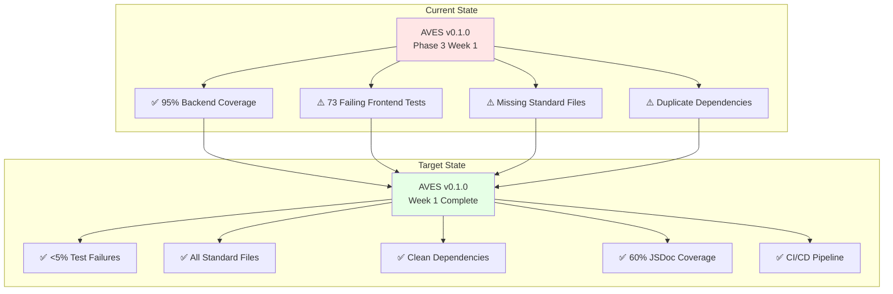

---

## ⏱️ Time Breakdown

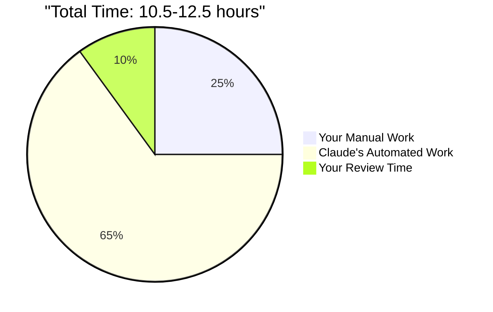

### Detailed Time Allocation

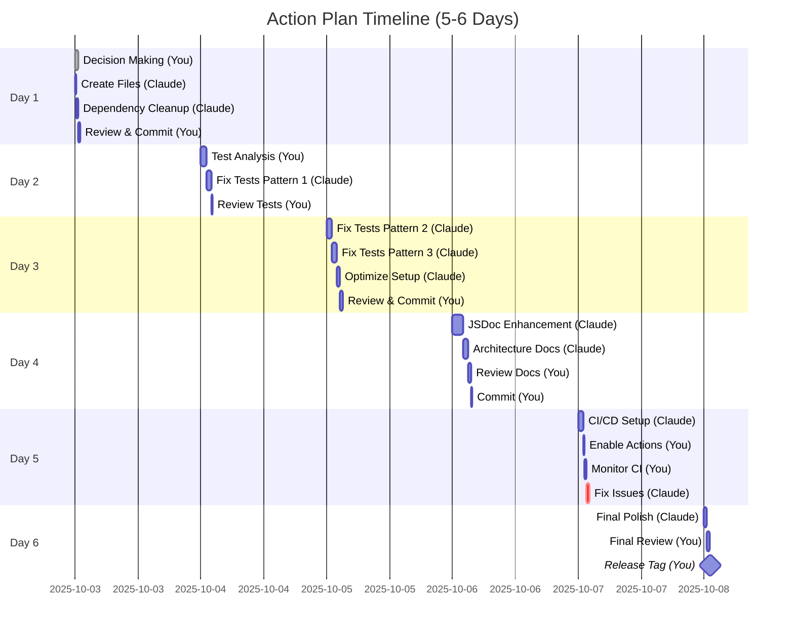

---

## 🎭 Responsibility Split

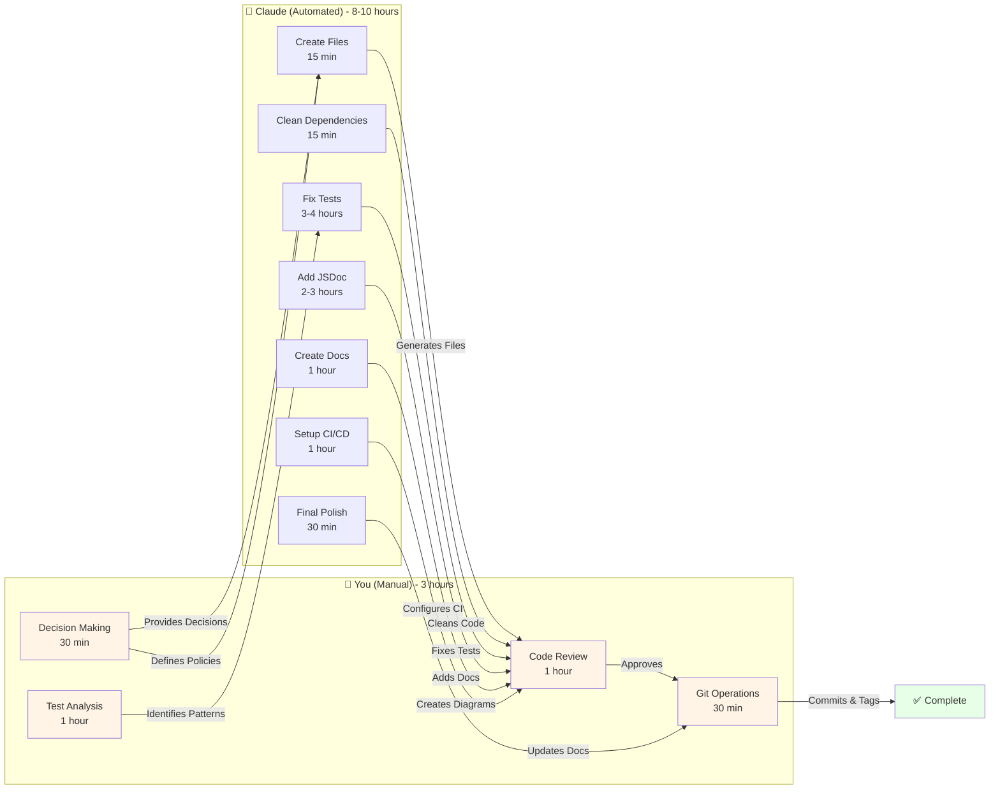

---

## 🔄 Complete Workflow

```mermaid
flowchart TD
    Start([📋 Start Action Plan]) --> Phase1{Phase 1:<br/>Critical Fixes}

    Phase1 -->|Manual| M1[Make Decisions<br/>📝 30 min]
    M1 --> M1A{Decisions Ready?}
    M1A -->|No| M1B[Review Templates<br/>& Examples]
    M1B --> M1
    M1A -->|Yes| A1[Claude: Create Files<br/>⚙️ 15 min]

    A1 --> A2[Claude: Audit Dependencies<br/>⚙️ 10 min]
    A2 --> A3{react-query v3<br/>Used?}
    A3 -->|Yes| A3A[Claude: Migrate Code<br/>⚙️ 30 min]
    A3 -->|No| A3B[Claude: Remove Dependency<br/>⚙️ 5 min]
    A3A --> R1
    A3B --> R1[Review Changes<br/>📝 15 min]

    R1 --> C1[Commit Phase 1<br/>📝 15 min]
    C1 --> Phase2{Phase 2:<br/>Test Fixes}

    Phase2 -->|Manual| M2[Run Tests & Analyze<br/>📝 1 hour]
    M2 --> M2A[Identify Patterns<br/>& Strategy]
    M2A --> A4[Claude: Fix Pattern 1<br/>⚙️ 1-2 hours]
    A4 --> R2[Review Fixes<br/>📝 15 min]
    R2 --> A5{More Patterns?}

    A5 -->|Yes| A6[Claude: Fix Next Pattern<br/>⚙️ 1-2 hours]
    A6 --> R2
    A5 -->|No| A7[Claude: Optimize Setup<br/>⚙️ 30 min]

    A7 --> T1[Run Full Test Suite<br/>📝 15 min]
    T1 --> T2{<5% Failures?}
    T2 -->|No| M3[Analyze Remaining<br/>Failures]
    M3 --> A4
    T2 -->|Yes| C2[Commit Phase 2<br/>📝 15 min]

    C2 --> Phase3{Phase 3:<br/>Documentation}

    Phase3 --> A8[Claude: Add JSDoc<br/>⚙️ 2-3 hours]
    A8 --> A9[Claude: Architecture Diagrams<br/>⚙️ 1 hour]
    A9 --> R3[Review Documentation<br/>📝 30 min]
    R3 --> R3A{Approved?}
    R3A -->|Changes Needed| R3B[Request Revisions]
    R3B --> A8
    R3A -->|Approved| C3[Commit Phase 3<br/>📝 15 min]

    C3 --> Phase4{Phase 4:<br/>CI/CD}

    Phase4 --> A10[Claude: Create Workflows<br/>⚙️ 1 hour]
    A10 --> M4[Enable GitHub Actions<br/>📝 5 min]
    M4 --> M5[Monitor First Run<br/>📝 10 min]
    M5 --> M5A{CI Passing?}

    M5A -->|No| M6[Identify Error]
    M6 --> A11[Claude: Fix CI Issue<br/>⚙️ 15-30 min]
    A11 --> M5
    M5A -->|Yes| C4[Commit Phase 4<br/>📝 15 min]

    C4 --> Phase5{Phase 5:<br/>Polish}

    Phase5 --> A12[Claude: Update Docs<br/>⚙️ 30 min]
    A12 --> M7[Final Quality Check<br/>📝 30 min]
    M7 --> M7A{All Green?}
    M7A -->|Issues| M8[Document Issues]
    M8 --> A12
    M7A -->|Pass| M9[Create Release Tag<br/>📝 15 min]

    M9 --> End([🎉 Complete!])

    style Start fill:#e1f5ff
    style End fill:#e6ffe6
    style M1 fill:#fff4e6
    style M2 fill:#fff4e6
    style M3 fill:#fff4e6
    style M4 fill:#fff4e6
    style M5 fill:#fff4e6
    style M6 fill:#fff4e6
    style M7 fill:#fff4e6
    style M9 fill:#fff4e6
    style A1 fill:#f0e6ff
    style A2 fill:#f0e6ff
    style A3A fill:#f0e6ff
    style A3B fill:#f0e6ff
    style A4 fill:#f0e6ff
    style A6 fill:#f0e6ff
    style A7 fill:#f0e6ff
    style A8 fill:#f0e6ff
    style A9 fill:#f0e6ff
    style A10 fill:#f0e6ff
    style A11 fill:#f0e6ff
    style A12 fill:#f0e6ff
```

---

## 📦 Phase 1: Critical Fixes (2.5 hours)

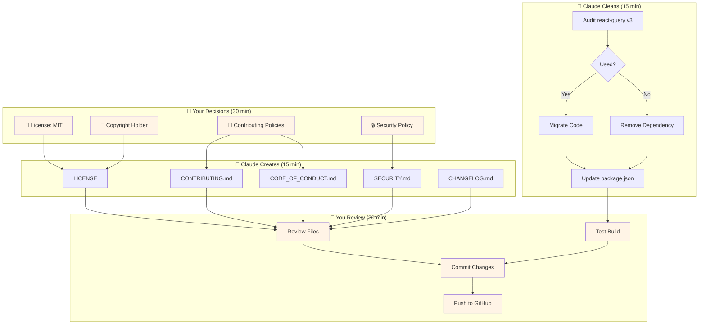

**Output**:
- ✅ 5 standard files created
- ✅ Duplicate dependency removed
- ✅ 1 git commit pushed

---

## 🧪 Phase 2: Test Stabilization (4-5 hours)

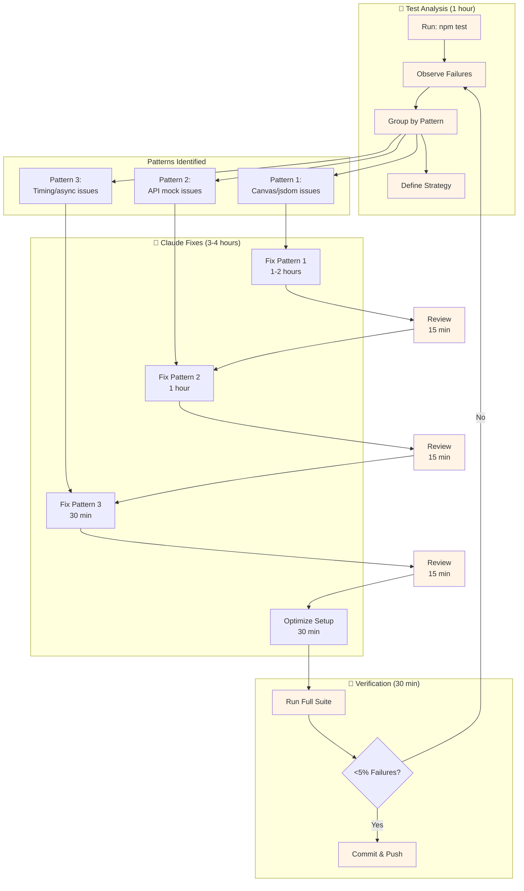

**Test Failure Reduction**:
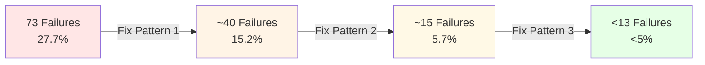

---

## 📚 Phase 3: Documentation (2-3 hours)

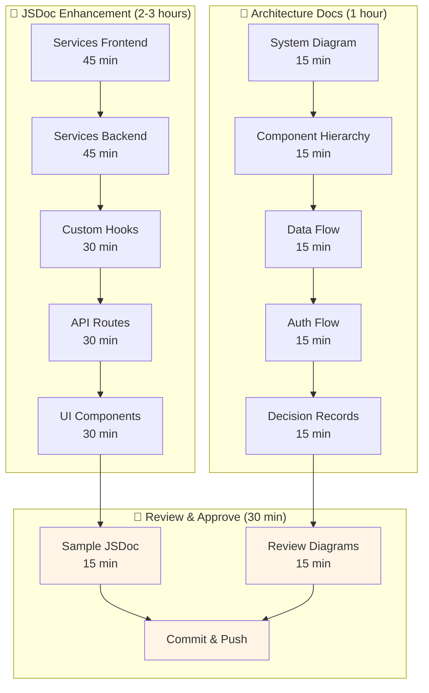

**JSDoc Coverage Growth**:
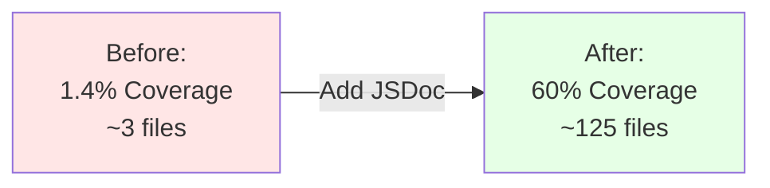

---

## 🚀 Phase 4: CI/CD Setup (1-2 hours)

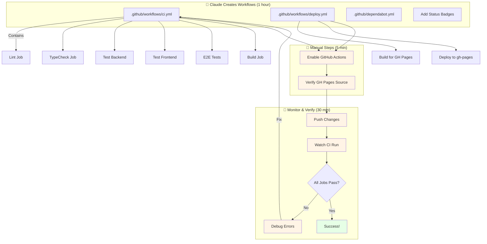

**CI/CD Pipeline**:
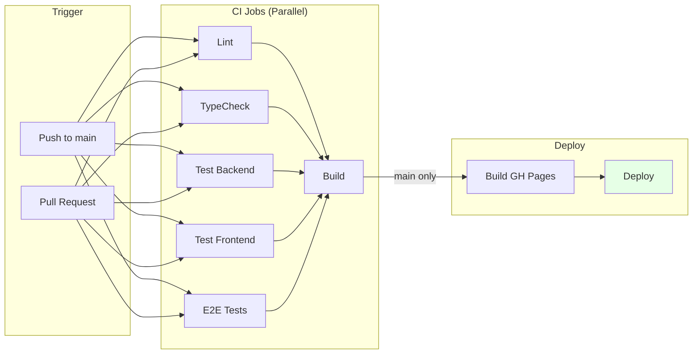

---

## ✨ Phase 5: Final Polish (1 hour)

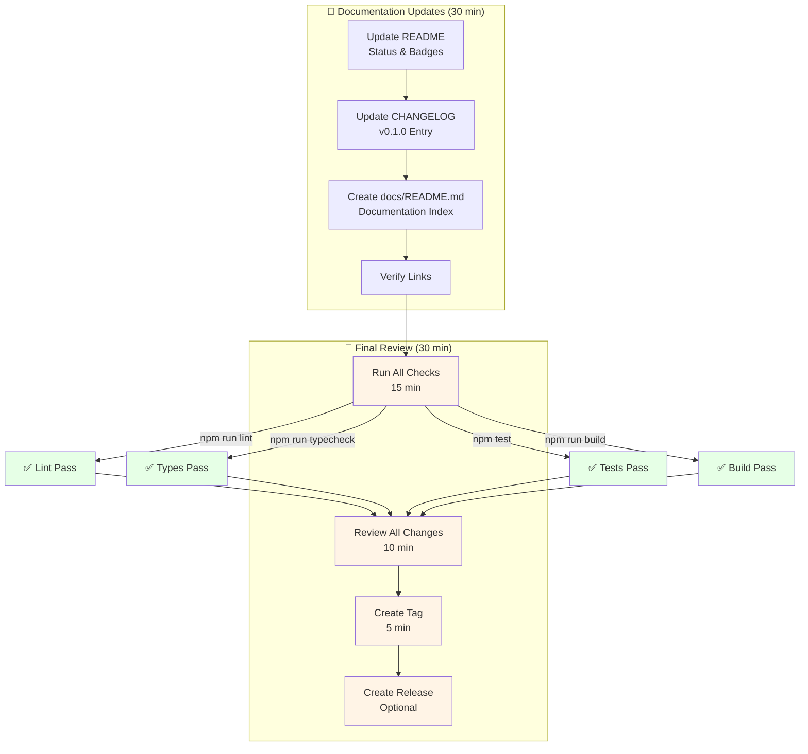

---

## 🎯 Task Dependencies

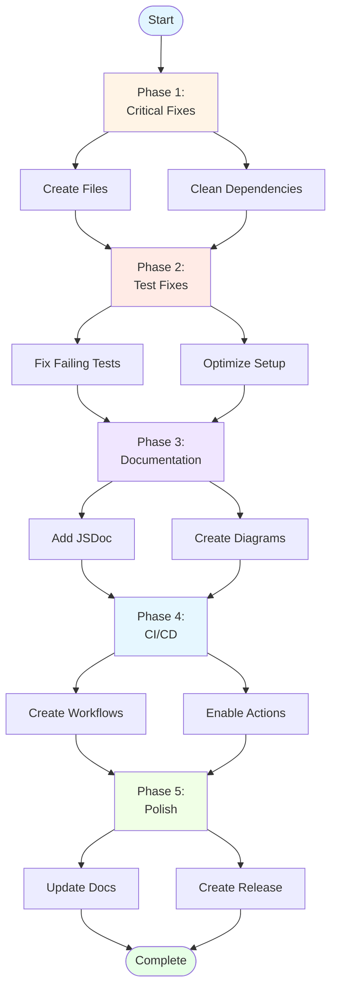

**Critical Path**: Phase 1 → Phase 2 → Phase 5
**Parallel Possible**: Phase 3 can start after Phase 1 (doesn't depend on Phase 2)

---

## 📊 Progress Tracking

### Phase Completion Checklist

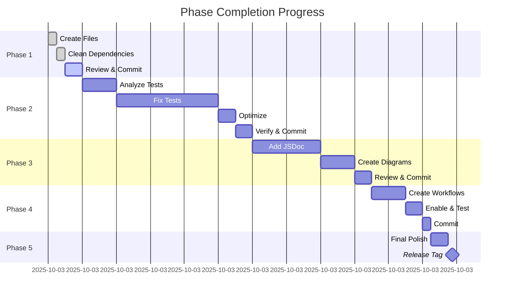

### Quality Metrics Dashboard

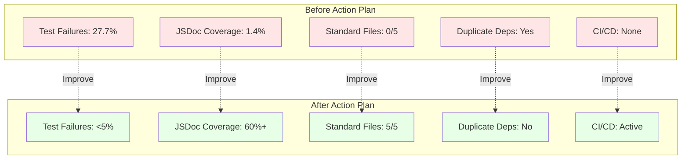

---

## 🔄 Iterative Workflow Pattern

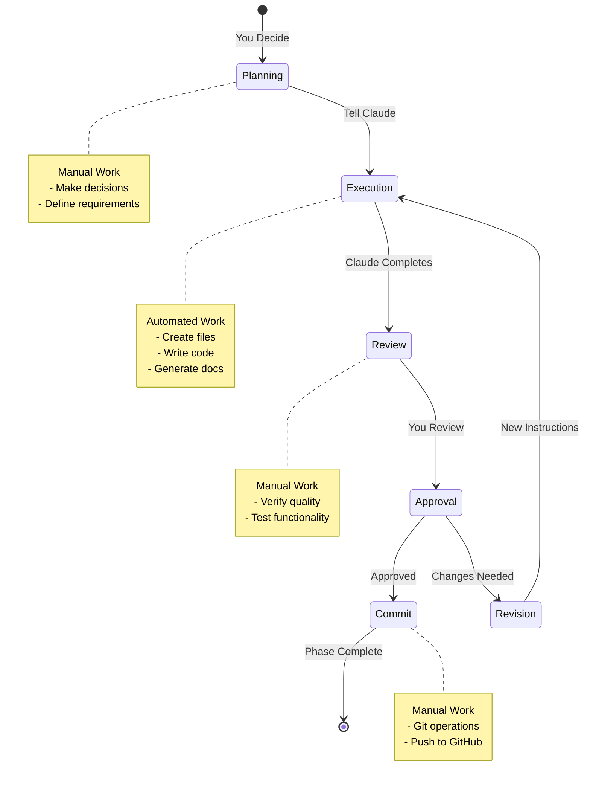

---

## 💡 Decision Flow

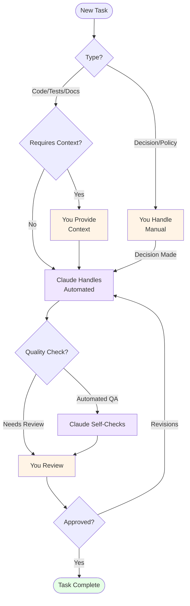

---

## 📈 Success Metrics

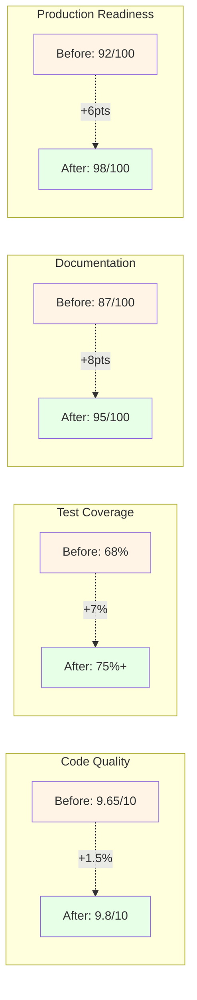

---

## 🎓 Learning Curve

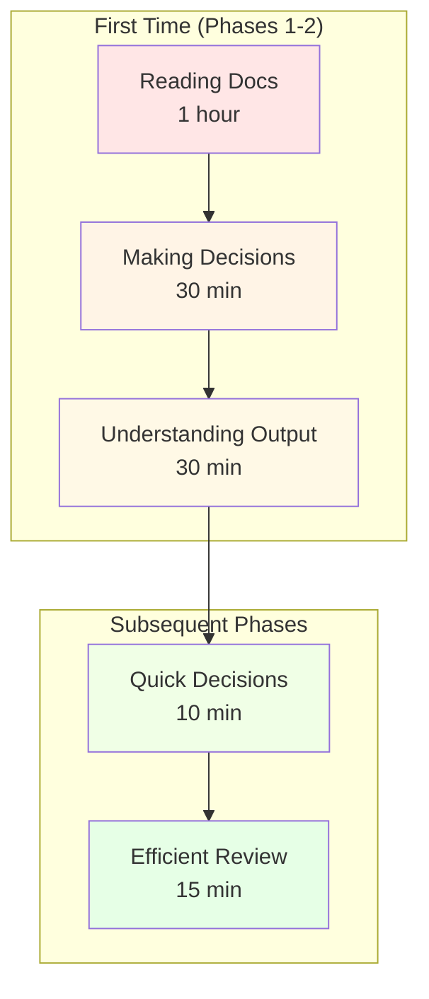

---

## 🚦 Status Indicators

### Throughout the Process

```mermaid
graph LR
    subgraph "Phase Status Colors"
        S1[🔴 Not Started]
        S2[🟡 In Progress]
        S3[🟢 Complete]
        S4[⚠️ Needs Attention]
    end

    subgraph "Task Owner"
        O1[👤 You - Manual]
        O2[🤖 Claude - Automated]
        O3[🤝 Collaborative]
    end

    subgraph "Priority"
        P1[🔥 Critical]
        P2[⭐ High]
        P3[📌 Medium]
        P4[💡 Low]
    end
```

---

## 📋 Quick Reference Card

| Symbol | Meaning | Time Range |
|--------|---------|------------|
| 👤 | You (Manual) | 5min - 1hr |
| 🤖 | Claude (Automated) | 15min - 4hrs |
| 📝 | Decision/Review | 5-30min |
| ⚙️ | Automated Work | 15min - 3hrs |
| ✅ | Completed | - |
| ⚠️ | Needs Attention | - |
| 🔥 | Critical Priority | ASAP |
| ⭐ | High Priority | This Week |
| 📌 | Medium Priority | Week 2 |
| 💡 | Low Priority | Week 3+ |

---

## 🎯 Next Steps

After reviewing these diagrams, you can:

1. **Start Immediately**: Tell me "Begin Phase 1" with your decisions
2. **Customize Timeline**: Adjust the 5-6 day plan to your schedule
3. **Pick Individual Tasks**: Don't have to do all phases at once
4. **Ask Questions**: About any specific diagram or workflow

**Ready to begin?** Just provide your Phase 1 decisions and I'll start creating files!

---

*All diagrams are in Mermaid.js format and will render on GitHub. You can also view them in VS Code with the Mermaid extension.*
