# GOAP Analysis: AVES Bird Learning Application
**Generated:** December 14, 2025
**Methodology:** Goal-Oriented Action Planning (GOAP)
**Analyst:** Claude Sonnet 4.5 (GOAP Specialist)

---

## Executive Summary

AVES is a bilingual (Spanish/English) bird learning platform with **strong foundational features** but opportunities for **optimization in user flows, data completeness, and feature integration**. This GOAP analysis identifies **28 actionable improvements** across 5 major feature areas.

**Key Findings:**
- ✅ **Working Well:** Learn feature, Practice exercises, Admin AI tools, Species browser
- ⚠️ **Needs Attention:** Image coverage gaps, cross-feature navigation, progressive disclosure
- 🚀 **High Impact Opportunities:** Image association completion, user progress tracking, annotation quality scoring

---

## 1. CURRENT STATE ASSESSMENT

### 1.1 Learn Feature (EnhancedLearnPage.tsx)
**Status:** ✅ **Functional** with room for optimization

**What Works:**
- ✅ Progressive disclosure system (5 levels: Hidden → Hover → Click → Etymology → Examples)
- ✅ Interactive image annotations with bounding boxes
- ✅ Module-based learning paths with URL parameter support
- ✅ Spaced Repetition System (SRS) integration for discovered terms
- ✅ Fallback data prevents empty states
- ✅ API integration with content publishing service
- ✅ Real-time progress tracking (discoveredTerms set)

**What's Missing/Broken:**
- ⚠️ **Species without images:** Some species lack `primaryImageUrl`, breaking the visual learning flow
- ⚠️ **Annotation sparsity:** Not all images have sufficient annotations (target: 5-10 per image)
- ⚠️ **Module progression:** No visual indication of which modules are unlocked/locked
- ⚠️ **Achievement system:** Milestone banners appear but don't persist across sessions
- ⚠️ **Etymology/Examples levels:** Hardcoded placeholders, not fully implemented

**Data Flow:**
```
useLearnContent() → ContentPublishingService → annotations table (published_at NOT NULL)
→ Transform to birdLearningData → Interactive annotations → SRS tracking
```

**Code Issues:**
- Line 196-226: Complex transformation from API content to bird learning format
- Line 43: Fallback data has only 5 hardcoded species (should use database)
- Line 253: Progress calculation doesn't account for module difficulty weighting

---

### 1.2 Practice Feature (EnhancedPracticePage.tsx)
**Status:** ✅ **Functional** with image dependency issues

**What Works:**
- ✅ Three exercise types: visual_match, fill_blank, multiple_choice
- ✅ SRS integration with quality calculation (response time + correctness)
- ✅ Real-time feedback with auto-advance (2s delay)
- ✅ Streak tracking and motivational messages
- ✅ Mode picker with difficulty/species/type filters
- ✅ Exercise service generates from real species data

**What's Missing/Broken:**
- ⚠️ **Image availability:** Service filters species by `annotationCount > 0 || primaryImageUrl` (line 43-45 of practiceExerciseService.ts)
  - If species lack images, exercise generation fails with "No exercises available" error
- ⚠️ **Exercise caching:** No persistence between sessions (always regenerates)
- ⚠️ **Adaptive difficulty:** Mode picker exists but exercises don't adapt to user performance
- ⚠️ **Progress persistence:** Score/streak reset on page reload
- ⚠️ **Exercise variety:** Limited templates (3 fill_blank, 3 multiple_choice templates)

**Data Flow:**
```
practiceExerciseService.generateMixedExercises(30)
→ getSpeciesWithImages() → Filter by annotationCount/imageUrl
→ Generate exercises with species.primaryImageUrl or API fallback
→ SRS recordReview() on completion
```

**Code Issues:**
- Line 43-45 (practiceExerciseService.ts): Relies on annotationCount which may be outdated
- Line 258-272: getImageUrl() has 3 fallback layers (primaryImageUrl → API endpoint → placeholder)
- Line 61-64: Loading state shows "Fetching bird species with images" but doesn't validate image URLs

---

### 1.3 Species Feature (SpeciesDetailPage.tsx + SpeciesPage.tsx)
**Status:** ✅ **Functional** with missing image associations

**What Works:**
- ✅ Species browser with taxonomic filtering
- ✅ Detail page with bilingual descriptions
- ✅ Conservation status indicators
- ✅ Habitat/color/taxonomy metadata display
- ✅ Learning section tab showing annotation count
- ✅ LazyImage component with loading states

**What's Missing/Broken:**
- ⚠️ **Image coverage:** Recent commit (0524276) added "AI-powered species verification for image collection"
  - Indicates some species STILL lack images despite verification system
- ⚠️ **Broken image handling:** No fallback UI when primaryImageUrl is null (shows bird emoji placeholder)
- ⚠️ **Learning tab integration:** SpeciesLearningSection component not fully connected to Practice
- ⚠️ **Image gallery:** Species have single primaryImageUrl, but images table supports multiple images per species

**Data Flow:**
```
useSpecies() → /api/species → species table + images table (LEFT JOIN)
→ annotationCount from trigger (update_image_annotation_count)
→ SpeciesDetailPage displays primaryImageUrl
```

**Database Schema Issues:**
- `species` table has NO `primaryImageUrl` column in migration 010
- Species→Images relationship is 1:Many, but no primary image selection logic
- annotationCount trigger (migration 010, line 96-116) updates images.annotation_count but NOT species.annotation_count

---

### 1.4 Admin AI Tools (Image Management + Annotation Review)
**Status:** ✅ **Functional** with workflow optimization needed

**What Works:**
- ✅ Unsplash image collection with species verification (commit 0524276)
- ✅ Batch annotation generation via GPT-4 Vision API
- ✅ Job tracking with progress monitoring
- ✅ Annotation review workflow (approve/reject/edit)
- ✅ Publishing pipeline to make content live
- ✅ Multi-panel admin dashboard with tabs

**What's Missing/Broken:**
- ⚠️ **Image quality scoring:** Migration 015 adds quality_score to images table, but not enforced in UI
- ⚠️ **Annotation quality validation:** No automatic quality checks before publishing
- ⚠️ **Bulk operations:** Delete/annotate functions exist but lack undo/audit trail
- ⚠️ **Species-image mismatch detection:** Verification added but no UI to show mismatches
- ⚠️ **Publishing workflow:** No preview before publishing, no rollback mechanism

**Data Flow:**
```
Image Collection: Admin UI → POST /api/admin/images/collect
→ Unsplash API → BirdDetectionService (species verification)
→ INSERT into images table

Annotation: Admin UI → POST /api/admin/images/annotate
→ VisionAIService (GPT-4 Vision) → ai_annotation_items table
→ Review → Approve → content.publish() → annotations.published_at = NOW()
```

**Code Issues:**
- Line 62-77 (ImageManagementPage.tsx): No validation before starting collection
- adminImageManagement.ts line 196-200: Upload directories created on-the-fly (should be pre-initialized)
- No image deduplication logic (same unsplash_id could be inserted twice if not caught by UNIQUE constraint)

---

### 1.5 Cross-Feature Integration
**Status:** ⚠️ **Partial** - Navigation exists but no shared state

**What Works:**
- ✅ Navigation links between Learn/Practice/Species
- ✅ URL parameter support for moduleId in Learn
- ✅ State-based navigation in SpeciesDetailPage (location.state.species)
- ✅ React Query caching reduces redundant API calls

**What's Missing/Broken:**
- ⚠️ **No shared progress context:** Each feature tracks progress independently
- ⚠️ **No "Continue Learning" flow:** Users can't resume where they left off
- ⚠️ **No cross-feature recommendations:** Practice doesn't suggest species based on Learn progress
- ⚠️ **No unified user dashboard:** UserDashboardPage exists but limited data aggregation
- ⚠️ **No notification system:** Achievements in Learn don't notify Practice, etc.

**Missing Components:**
- UserProgressContext (global state for discovered terms, completed modules, mastered species)
- Learning journey visualization (you are here → next recommended action)
- Cross-feature analytics (time spent per feature, completion rates)

---

## 2. GOAL STATE DEFINITION

### 2.1 Learn Feature - Ideal Functionality
**Goal:** Seamless visual vocabulary acquisition with rich annotations and progressive complexity

**Desired Outcomes:**
- ✅ 100% of active species have high-quality images (quality_score >= 0.7)
- ✅ Every image has 5-10 annotations covering anatomy, behavior, and colors
- ✅ Etymology and Examples levels fully implemented with linguistic data
- ✅ Module progression shows clear learning path (locked/unlocked indicators)
- ✅ Achievements persist across sessions and sync to user profile
- ✅ Adaptive difficulty adjusts annotation visibility based on user mastery
- ✅ Offline support with cached content for discovered terms

**Key Metrics:**
- Average 8 annotations per image (current: ~3-5 based on seeded data)
- 90%+ species have primaryImageUrl (current: estimated 60-70%)
- Module completion rate visible in UI
- User retention: 70%+ return after first session

---

### 2.2 Practice Feature - Ideal Functionality
**Goal:** Adaptive exercise generation with personalized difficulty and comprehensive coverage

**Desired Outcomes:**
- ✅ Zero "No exercises available" errors (all species have images)
- ✅ Exercise difficulty adapts based on SRS performance data
- ✅ Progress persists across sessions (score, streak, completed exercises)
- ✅ Exercise variety expands to 10+ templates per type
- ✅ Audio pronunciation exercises for Spanish terms
- ✅ Spaced repetition scheduling (review terms at optimal intervals)
- ✅ Performance analytics visible to user (weak areas, mastery levels)

**Key Metrics:**
- 100% species coverage in exercise pool
- Average session length: 10-15 minutes (current: ~5-7 based on 30 exercises)
- Accuracy trending upward over sessions
- SRS scheduling effectiveness (optimal recall rate ~85%)

---

### 2.3 Species Feature - Ideal Functionality
**Goal:** Comprehensive bird encyclopedia with multimedia learning integration

**Desired Outcomes:**
- ✅ Every species has primary image + 2-5 additional images
- ✅ Image gallery with zoom/pan on detail page
- ✅ "Start Learning" button on detail page → direct link to Learn with speciesId filter
- ✅ "Practice This Species" button → filtered Practice exercises
- ✅ Related species recommendations based on taxonomy
- ✅ Distribution maps showing habitat ranges
- ✅ Conservation status with actionable links (e.g., donate to protection orgs)

**Key Metrics:**
- 100% species have primaryImageUrl
- Average 3 images per species
- Click-through rate to Learn/Practice from Species detail: 40%+

---

### 2.4 Admin AI Tools - Ideal Functionality
**Goal:** Efficient content creation pipeline with quality assurance and version control

**Desired Outcomes:**
- ✅ Automated quality scoring for images before collection
- ✅ Annotation quality validation (coherence, accuracy, completeness)
- ✅ Preview mode before publishing content to live site
- ✅ Version control for annotations (track edits, allow rollback)
- ✅ Audit trail for all admin actions (who published what, when)
- ✅ Bulk operations with undo queue (30s grace period)
- ✅ A/B testing framework for annotation phrasing

**Key Metrics:**
- Average time from image collection to published content: <10 minutes
- Annotation approval rate: 85%+ (high AI quality)
- Rejected annotation rate: <10%
- Zero accidental deletions (undo safety net)

---

### 2.5 Cross-Feature Integration - Ideal Functionality
**Goal:** Unified learning journey with personalized recommendations and seamless transitions

**Desired Outcomes:**
- ✅ UserProgressContext provides global state for all features
- ✅ "Continue Learning" button on homepage → last active module/species
- ✅ Practice exercises prioritize terms from recently viewed Learn content
- ✅ Species detail page shows user's mastery level for that species
- ✅ Achievements/badges unlock across features (e.g., "Master 10 species in Practice")
- ✅ Learning analytics dashboard (weekly progress, vocabulary growth chart)
- ✅ Mobile app integration with push notifications for review reminders

**Key Metrics:**
- Feature-to-feature navigation rate: 60%+ (users engage with multiple features per session)
- Return user rate: 70%+ within 7 days
- Average session flow: Learn → Practice → Species (or reverse)
- User NPS (Net Promoter Score): 8+/10

---

## 3. ACTIONS LIST (28 Total)

### Priority: HIGH (Immediate Impact) - 10 Actions

#### H1: Fix Species Image Coverage Gap
**Current State:** Some species lack `primaryImageUrl`, breaking Learn/Practice flows
**Goal State:** 100% species have valid image URLs
**Preconditions:**
- Database connection available
- Unsplash API access OR local image uploads enabled
**Effects:**
- `species.primaryImageUrl` populated for all records
- Practice exercise generation succeeds for all species
- Learn feature has visual content for all modules
**Implementation:**
```sql
-- Find species without images
SELECT id, spanish_name, english_name
FROM species s
WHERE NOT EXISTS (SELECT 1 FROM images i WHERE i.species_id = s.id)
OR id NOT IN (SELECT DISTINCT species_id FROM images WHERE url IS NOT NULL);

-- Trigger image collection via admin API for missing species
POST /api/admin/images/collect { speciesIds: [...], imagesPerSpecies: 2 }
```
**File Changes:**
- `backend/src/database/migrations/026_fix_missing_species_images.sql` (new migration)
- `backend/src/routes/species.ts` (add validation to block species without images from being shown)

**Estimated Effort:** 2-4 hours
**Dependencies:** None

---

#### H2: Implement Primary Image Selection Logic
**Current State:** Species→Images is 1:Many but no `primaryImageUrl` column in species table
**Goal State:** Each species has designated primary image with fallback logic
**Preconditions:**
- H1 completed (all species have images)
**Effects:**
- `species` table has `primary_image_id UUID REFERENCES images(id)`
- Automatic selection of highest quality_score image as primary
- Species API response includes `primaryImageUrl` reliably
**Implementation:**
```sql
-- Migration to add primary_image_id to species table
ALTER TABLE species ADD COLUMN primary_image_id UUID REFERENCES images(id);

-- Function to auto-select primary image (highest quality_score, most annotations)
CREATE FUNCTION auto_select_primary_image(p_species_id UUID) RETURNS VOID AS $$
  UPDATE species SET primary_image_id = (
    SELECT id FROM images
    WHERE species_id = p_species_id
    ORDER BY quality_score DESC NULLS LAST, annotation_count DESC
    LIMIT 1
  ) WHERE id = p_species_id;
$$ LANGUAGE sql;

-- Trigger to run after new images inserted
CREATE TRIGGER trigger_auto_primary_image
  AFTER INSERT OR UPDATE ON images
  FOR EACH ROW EXECUTE FUNCTION auto_select_primary_image(NEW.species_id);
```
**File Changes:**
- `backend/src/database/migrations/027_add_primary_image_selection.sql`
- `backend/src/routes/species.ts` (JOIN with images to get primaryImageUrl)
- `shared/types/species.types.ts` (add `primaryImageId` field)

**Estimated Effort:** 3-5 hours
**Dependencies:** H1 (species must have images first)

---

#### H3: Add Annotation Quality Validation Pre-Publishing
**Current State:** Annotations published without automated quality checks
**Goal State:** 95%+ published annotations pass quality thresholds
**Preconditions:**
- Annotation review workflow functional
**Effects:**
- Quality scoring system (coherence, bounding box accuracy, term correctness)
- Admin UI shows quality score before publishing
- Low-quality annotations auto-flagged for human review
**Implementation:**
```typescript
// backend/src/services/AnnotationQualityScorer.ts
interface QualityMetrics {
  coherenceScore: number;      // 0-1: Does term match image region?
  boundingBoxAccuracy: number;  // 0-1: Is bbox properly sized/positioned?
  termCorrectness: number;      // 0-1: Is Spanish term valid?
  overallScore: number;         // Weighted average
}

class AnnotationQualityScorer {
  async scoreAnnotation(annotation: Annotation): Promise<QualityMetrics> {
    // 1. Coherence: Use CLIP embeddings to check image-text alignment
    // 2. Bounding box: Check if bbox area is 5-30% of image (anatomical features)
    // 3. Term correctness: Validate against Spanish ornithology dictionary
  }
}
```
**File Changes:**
- `backend/src/services/AnnotationQualityScorer.ts` (new service)
- `backend/src/routes/ai-annotations/review.routes.ts` (add quality scoring step)
- `frontend/src/components/admin/AnnotationReviewPanel.tsx` (display quality score)

**Estimated Effort:** 8-12 hours (includes CLIP integration)
**Dependencies:** None

---

#### H4: Persist Practice Progress Across Sessions
**Current State:** Score, streak, completed exercises reset on page reload
**Goal State:** User progress synced to database and local storage
**Preconditions:**
- User authentication (Supabase auth)
- Database table for user progress
**Effects:**
- `user_progress` table tracks completed exercises, scores, streaks
- Practice page loads previous session state
- Users can resume practice from where they left off
**Implementation:**
```sql
-- Migration 024_user_progress.sql already exists, extend it:
ALTER TABLE user_progress ADD COLUMN practice_state JSONB DEFAULT '{
  "score": 0,
  "totalAttempts": 0,
  "streak": 0,
  "completedExerciseIds": []
}'::jsonb;

CREATE INDEX idx_user_progress_practice ON user_progress
  USING GIN ((practice_state->'completedExerciseIds'));
```
**File Changes:**
- `backend/src/database/migrations/028_extend_user_progress_practice.sql`
- `frontend/src/hooks/usePracticeProgress.ts` (new hook with React Query)
- `frontend/src/pages/EnhancedPracticePage.tsx` (load progress on mount, save on exercise completion)

**Estimated Effort:** 5-8 hours
**Dependencies:** Supabase auth enabled

---

#### H5: Implement Module Progression Indicators
**Current State:** LearningPathSelector shows modules but no lock/unlock state
**Goal State:** Visual indicators for module prerequisites and completion
**Preconditions:**
- Learning modules table populated (migration 023 exists)
- User progress tracking (H4)
**Effects:**
- Locked modules show lock icon + prerequisite name
- Completed modules show checkmark + completion date
- Progress bar for active module
**Implementation:**
```typescript
// frontend/src/components/learn/ModuleProgressCard.tsx
interface ModuleProgressCardProps {
  module: LearningModule;
  userProgress: UserModuleProgress;
  isLocked: boolean;
  prerequisiteName?: string;
}

// backend API: GET /api/content/modules?userId=xxx
// Returns modules with isLocked, completionPercentage, prerequisiteStatus
```
**File Changes:**
- `frontend/src/components/learn/ModuleProgressCard.tsx` (new component)
- `frontend/src/components/learn/LearningPathSelector.tsx` (use ModuleProgressCard)
- `backend/src/services/ContentPublishingService.ts` (add user-specific module state)

**Estimated Effort:** 6-10 hours
**Dependencies:** H4 (needs user progress data)

---

#### H6: Add Etymology and Examples Levels to Annotations
**Current State:** Lines 103-106 in EnhancedLearnPage.tsx have placeholder text
**Goal State:** Rich linguistic data for each annotation (word origin, usage examples)
**Preconditions:**
- Annotation schema supports etymology and examples fields
**Effects:**
- `annotations` table has `etymology TEXT` and `examples JSONB` columns
- Learn feature shows 5 fully functional disclosure levels
- Enhanced vocabulary retention through linguistic context
**Implementation:**
```sql
-- Migration to add etymology/examples
ALTER TABLE annotations
  ADD COLUMN etymology TEXT,
  ADD COLUMN examples JSONB DEFAULT '[]'::jsonb;

-- Example data structure for examples:
{
  "examples": [
    { "spanish": "El águila tiene las garras afiladas.", "english": "The eagle has sharp talons." },
    { "spanish": "Las garras del búho son muy fuertes.", "english": "The owl's talons are very strong." }
  ]
}
```
**File Changes:**
- `backend/src/database/migrations/029_add_etymology_examples.sql`
- `shared/types/annotation.types.ts` (add etymology, examples fields)
- `frontend/src/components/learn/VocabularyPanel.tsx` (display new levels)
- `backend/src/services/ai-annotations/AIAnnotationGenerator.ts` (GPT-4 prompt to generate etymology)

**Estimated Effort:** 10-15 hours (includes GPT-4 prompt engineering for etymology generation)
**Dependencies:** None

---

#### H7: Fix Exercise Generation Error Handling
**Current State:** Practice shows "No exercises available" when species filter returns empty
**Goal State:** Graceful degradation with helpful error messages
**Preconditions:**
- H1 completed (reduces likelihood of empty species pool)
**Effects:**
- Clear error messages explaining why no exercises available
- Fallback to less restrictive filters (e.g., ignore difficulty if no matches)
- Retry button to refresh species data
**Implementation:**
```typescript
// frontend/src/services/practiceExerciseService.ts
async generateMixedExercises(totalCount: number = 30): Promise<PracticeExercise[]> {
  let exercises: PracticeExercise[] = [];

  // Try with full filters first
  exercises = await this.tryGenerateWithFilters(totalCount, { strictImageCheck: true });

  // Fallback: Relax image requirement
  if (exercises.length === 0) {
    console.warn('No species with images found, relaxing image requirement');
    exercises = await this.tryGenerateWithFilters(totalCount, { strictImageCheck: false });
  }

  // Fallback: Use all species regardless of images (with placeholder images)
  if (exercises.length < 10) {
    console.warn('Not enough exercises, using placeholder images');
    exercises = await this.generateWithPlaceholders(totalCount);
  }

  return exercises;
}
```
**File Changes:**
- `frontend/src/services/practiceExerciseService.ts` (add fallback logic)
- `frontend/src/pages/EnhancedPracticePage.tsx` (display helpful error messages)

**Estimated Effort:** 3-5 hours
**Dependencies:** H1 (reduces need for fallbacks)

---

#### H8: Add "Start Learning" and "Practice This Species" Buttons to Species Detail
**Current State:** Species detail page has learning tab but no direct action buttons
**Goal State:** One-click navigation from Species → Learn/Practice with species filter
**Preconditions:**
- Learn and Practice pages support species filtering (needs implementation)
**Effects:**
- Species detail page has prominent CTA buttons
- Learn page accepts `?speciesId=xxx` parameter to filter content
- Practice page accepts `?speciesId=xxx` to generate species-specific exercises
**Implementation:**
```typescript
// frontend/src/pages/SpeciesDetailPage.tsx
<div className="flex gap-3 mt-6">
  <Link
    to={`/learn?speciesId=${species.id}`}
    className="btn-primary"
  >
    📚 Start Learning This Species
  </Link>
  <Link
    to={`/practice?speciesId=${species.id}`}
    className="btn-secondary"
  >
    ✏️ Practice This Species
  </Link>
</div>

// frontend/src/pages/EnhancedLearnPage.tsx
const speciesIdFromUrl = searchParams.get('speciesId');
const { data: apiContent } = useLearnContent({ speciesId: speciesIdFromUrl });

// frontend/src/services/practiceExerciseService.ts
async generateMixedExercises(totalCount: number, filters?: { speciesId?: string }) {
  const species = await this.getSpeciesWithImages(filters?.speciesId);
  // ...
}
```
**File Changes:**
- `frontend/src/pages/SpeciesDetailPage.tsx` (add CTA buttons)
- `frontend/src/pages/EnhancedLearnPage.tsx` (support speciesId filter)
- `frontend/src/pages/EnhancedPracticePage.tsx` (support speciesId filter)
- `frontend/src/services/practiceExerciseService.ts` (add speciesId filtering)

**Estimated Effort:** 4-6 hours
**Dependencies:** None

---

#### H9: Add User Progress Dashboard Widget
**Current State:** UserDashboardPage exists but limited data aggregation
**Goal State:** Comprehensive progress overview with charts and recommendations
**Preconditions:**
- H4 completed (user progress tracking)
- User authentication
**Effects:**
- Dashboard shows: total vocabulary learned, practice accuracy, module completion
- Charts: weekly activity, mastery distribution, streak calendar
- Recommendations: "Review these 10 terms" (SRS due), "Complete Module 3", etc.
**Implementation:**
```typescript
// frontend/src/pages/UserDashboardPage.tsx
const { data: progressData } = useQuery({
  queryKey: ['userProgress', userId],
  queryFn: () => api.users.getProgress(userId)
});

<ProgressOverviewWidget
  vocabularyLearned={progressData.learnedTermsCount}
  practiceAccuracy={progressData.practiceAccuracy}
  modulesCompleted={progressData.completedModulesCount}
  currentStreak={progressData.streak}
/>

<ActivityChartWidget weeklyData={progressData.weeklyActivity} />
<RecommendationsWidget recommendations={progressData.nextActions} />
```
**File Changes:**
- `frontend/src/pages/UserDashboardPage.tsx` (add widgets)
- `frontend/src/components/dashboard/ProgressOverviewWidget.tsx` (new component)
- `frontend/src/components/dashboard/ActivityChartWidget.tsx` (use Chart.js or Recharts)
- `backend/src/routes/users/progress.routes.ts` (aggregate progress API endpoint)

**Estimated Effort:** 12-16 hours (includes charting library integration)
**Dependencies:** H4 (user progress data)

---

#### H10: Implement Image Quality Pre-Upload Validation
**Current State:** Images collected without quality checks, leading to low-quality images
**Goal State:** Only high-quality images (quality_score >= 0.7) collected
**Preconditions:**
- ImageQualityValidator service functional (already exists)
**Effects:**
- Unsplash image collection rejects low-resolution, blurry, or poorly-composed images
- quality_score populated during collection, not post-hoc
- Admin UI shows quality metrics during collection job
**Implementation:**
```typescript
// backend/src/routes/adminImageManagement.ts (image collection endpoint)
for (const speciesId of speciesIds) {
  const unsplashImages = await fetchUnsplashImages(species.searchTerms);

  for (const img of unsplashImages) {
    // Pre-validate quality BEFORE inserting
    const qualityMetrics = await imageQualityValidator.validateImage(img.urls.regular);

    if (qualityMetrics.overallScore < 0.7) {
      console.log(`Skipping low-quality image ${img.id}: score=${qualityMetrics.overallScore}`);
      continue;
    }

    // Insert with quality_score
    await pool.query(
      'INSERT INTO images (species_id, unsplash_id, url, quality_score, ...) VALUES (...)',
      [speciesId, img.id, img.urls.regular, qualityMetrics.overallScore, ...]
    );
  }
}
```
**File Changes:**
- `backend/src/routes/adminImageManagement.ts` (add quality validation in collection loop)
- `backend/src/services/ImageQualityValidator.ts` (ensure validateImage is async and efficient)
- `frontend/src/components/admin/ImageCollectionJobMonitor.tsx` (show quality stats)

**Estimated Effort:** 6-8 hours
**Dependencies:** None

---

### Priority: MEDIUM (Important but not blocking) - 12 Actions

#### M1: Expand Practice Exercise Templates
**Current State:** 3 templates per exercise type (fill_blank, multiple_choice)
**Goal State:** 10+ templates per type for variety
**Estimated Effort:** 8-12 hours
**Dependencies:** None

#### M2: Add Audio Pronunciation for Spanish Terms
**Current State:** No audio support
**Goal State:** Text-to-speech or pre-recorded audio for each term
**Estimated Effort:** 15-20 hours (includes TTS API integration or audio recording)
**Dependencies:** None

#### M3: Implement Spaced Repetition Scheduling UI
**Current State:** SRS tracks reviews but doesn't schedule future reviews
**Goal State:** "Due for review" indicator, notification system
**Estimated Effort:** 10-15 hours
**Dependencies:** H4 (user progress tracking)

#### M4: Add Image Gallery to Species Detail Page
**Current State:** Single image displayed
**Goal State:** 3-5 images per species with lightbox view
**Estimated Effort:** 6-10 hours
**Dependencies:** H2 (primary image selection)

#### M5: Implement Related Species Recommendations
**Current State:** No species recommendations
**Goal State:** "Similar species" based on taxonomy/habitat
**Estimated Effort:** 5-8 hours
**Dependencies:** None

#### M6: Add Annotation Version Control
**Current State:** Edits overwrite annotations, no history
**Goal State:** Track annotation edits, allow rollback
**Estimated Effort:** 12-16 hours
**Dependencies:** None

#### M7: Add Publishing Preview Mode
**Current State:** Annotations published immediately without preview
**Goal State:** "Preview as student" mode before publishing
**Estimated Effort:** 8-12 hours
**Dependencies:** None

#### M8: Implement Bulk Operation Undo Queue
**Current State:** Bulk delete is permanent
**Goal State:** 30-second undo grace period for bulk operations
**Estimated Effort:** 6-10 hours
**Dependencies:** None

#### M9: Add Conservation Status Action Links
**Current State:** Conservation status displayed but not actionable
**Goal State:** Links to protection organizations, donation options
**Estimated Effort:** 4-6 hours
**Dependencies:** None

#### M10: Implement Cross-Feature Navigation Tracking
**Current State:** No analytics on user flow between features
**Goal State:** Track Learn→Practice→Species transitions
**Estimated Effort:** 5-8 hours
**Dependencies:** Analytics system (Google Analytics or custom)

#### M11: Add Offline Support with Cached Content
**Current State:** Requires internet connection
**Goal State:** Service Worker caches images and annotations
**Estimated Effort:** 10-15 hours
**Dependencies:** None

#### M12: Implement Mobile App Push Notifications
**Current State:** Web-only, no reminders
**Goal State:** Daily review reminders, achievement notifications
**Estimated Effort:** 20-30 hours (requires mobile app or PWA setup)
**Dependencies:** M3 (SRS scheduling)

---

### Priority: LOW (Nice-to-have, long-term) - 6 Actions

#### L1: Add Distribution Maps to Species Detail
**Current State:** No geographic data
**Goal State:** Interactive maps showing habitat ranges
**Estimated Effort:** 15-20 hours (includes map library integration)
**Dependencies:** Geographic data source (eBird API, etc.)

#### L2: Implement A/B Testing for Annotation Phrasing
**Current State:** Single annotation version
**Goal State:** Test multiple phrasings to optimize learning
**Estimated Effort:** 20-30 hours (requires experimentation framework)
**Dependencies:** H4 (user progress tracking)

#### L3: Add Gamification Badges and Leaderboards
**Current State:** Simple milestone banners
**Goal State:** Comprehensive badge system, global leaderboards
**Estimated Effort:** 15-25 hours
**Dependencies:** H4 (user progress tracking)

#### L4: Implement Social Features (Share Progress)
**Current State:** Individual learning only
**Goal State:** Share achievements on social media, invite friends
**Estimated Effort:** 10-15 hours
**Dependencies:** H9 (dashboard)

#### L5: Add Machine Learning for Adaptive Difficulty
**Current State:** Static difficulty levels
**Goal State:** ML model predicts optimal difficulty per user
**Estimated Effort:** 40-60 hours (includes ML model training)
**Dependencies:** H4 (large dataset of user performance)

#### L6: Implement Collaborative Annotation Review
**Current State:** Single admin reviews annotations
**Goal State:** Multiple experts vote on annotation quality
**Estimated Effort:** 20-30 hours
**Dependencies:** Multi-user admin system

---

## 4. ACTION DEPENDENCIES (Directed Acyclic Graph)

```mermaid
graph TD
    H1[H1: Fix Species Image Coverage] --> H2[H2: Primary Image Selection Logic]
    H1 --> H7[H7: Fix Exercise Generation Errors]
    H2 --> M4[M4: Image Gallery]

    H4[H4: Persist Practice Progress] --> H5[H5: Module Progression Indicators]
    H4 --> H9[H9: User Progress Dashboard]
    H4 --> M3[M3: SRS Scheduling UI]

    H9 --> M10[M10: Navigation Tracking]
    M3 --> M12[M12: Push Notifications]

    H2 --> L1[L1: Distribution Maps]
    H4 --> L2[L2: A/B Testing]
    H4 --> L3[L3: Gamification]
    H9 --> L4[L4: Social Features]
    H4 --> L5[L5: ML Adaptive Difficulty]

    H3[H3: Annotation Quality Validation] --> M6[M6: Version Control]
    H3 --> M7[M7: Publishing Preview]

    H6[H6: Etymology/Examples Levels] -.-> M2[M2: Audio Pronunciation]
    H8[H8: Species→Learn/Practice CTAs] -.-> H5
    H10[H10: Image Quality Pre-Upload] -.-> H1

    M1[M1: Expand Exercise Templates] -.-> H7
    M8[M8: Bulk Operation Undo] -.-> M6
    M9[M9: Conservation Action Links] -.-> L1
    M11[M11: Offline Support] -.-> H2

    L6[L6: Collaborative Review] -.-> M6

    classDef high fill:#ff6b6b,stroke:#c92a2a,color:#fff
    classDef medium fill:#ffd43b,stroke:#fab005,color:#000
    classDef low fill:#69db7c,stroke:#37b24d,color:#fff

    class H1,H2,H3,H4,H5,H6,H7,H8,H9,H10 high
    class M1,M2,M3,M4,M5,M6,M7,M8,M9,M10,M11,M12 medium
    class L1,L2,L3,L4,L5,L6 low
```



**Dependency Explanation:**
- **Solid arrows:** Hard dependencies (must complete before starting next)
- **Dotted arrows:** Soft dependencies (recommended but not required)

**Critical Path (longest dependency chain):**
```
H4 → H5 → H9 → M10 (14 hours + 10 hours + 16 hours + 8 hours = 48 hours)
```

**Independent Actions (can start immediately):**
- H1, H3, H6, H8, H10
- M1, M2, M5, M9, M11
- L1, L4, L6

---

## 5. PRIORITY RANKING SUMMARY

### High Priority (10 actions, ~70-90 hours total)
**Rationale:** These actions fix critical user-facing issues and enable dependent features.

| Action | Effort | Impact | Blockers | Reason for High Priority |
|--------|--------|--------|----------|--------------------------|
| H1: Fix Image Coverage | 2-4h | Very High | Practice/Learn failures | Unblocks exercise generation |
| H2: Primary Image Selection | 3-5h | Very High | Species display issues | Systematic image association |
| H3: Annotation Quality | 8-12h | High | Publishing low-quality content | Maintains content standards |
| H4: Practice Progress | 5-8h | Very High | User retention | Core UX improvement |
| H5: Module Progression | 6-10h | High | Learning path clarity | Enables structured learning |
| H6: Etymology/Examples | 10-15h | High | Incomplete Learn feature | Completes 5-level system |
| H7: Exercise Error Handling | 3-5h | Very High | User frustration | Graceful degradation |
| H8: Species CTAs | 4-6h | High | Feature discoverability | Cross-feature integration |
| H9: User Dashboard | 12-16h | Very High | User engagement | Central progress view |
| H10: Image Quality Validation | 6-8h | High | Low-quality images | Upstream quality control |

**Total Estimated Effort:** 59-89 hours (~7-11 working days for 1 developer)

---

### Medium Priority (12 actions, ~120-180 hours total)
**Rationale:** Important for user experience and feature completeness, but not immediately blocking.

| Action | Effort | Impact | Dependencies | Reason for Medium Priority |
|--------|--------|--------|--------------|----------------------------|
| M1: Exercise Templates | 8-12h | Medium | None | Increases variety but not critical |
| M2: Audio Pronunciation | 15-20h | High | H6 (soft) | Major UX improvement but complex |
| M3: SRS Scheduling UI | 10-15h | High | H4 | Enhances learning but needs progress tracking |
| M4: Image Gallery | 6-10h | Medium | H2 | Nice-to-have, not blocking |
| M5: Related Species | 5-8h | Medium | None | Discovery feature, low priority |
| M6: Version Control | 12-16h | Medium | H3 | Admin workflow improvement |
| M7: Publishing Preview | 8-12h | Medium | H3 | Reduces errors but not critical |
| M8: Bulk Undo Queue | 6-10h | Low | None | Safety net for admins |
| M9: Conservation Links | 4-6h | Low | None | External integration |
| M10: Navigation Tracking | 5-8h | Medium | H9 | Analytics, not user-facing |
| M11: Offline Support | 10-15h | Medium | H2 | PWA enhancement |
| M12: Push Notifications | 20-30h | High | M3 | Retention tool but requires infrastructure |

**Total Estimated Effort:** 109-162 hours (~14-20 working days)

---

### Low Priority (6 actions, ~120-200 hours total)
**Rationale:** Long-term enhancements that require significant effort or external dependencies.

| Action | Effort | Impact | Dependencies | Reason for Low Priority |
|--------|--------|--------|--------------|-------------------------|
| L1: Distribution Maps | 15-20h | Medium | External API | Requires eBird API integration |
| L2: A/B Testing | 20-30h | Low | H4, large dataset | Experimentation framework, needs data |
| L3: Gamification | 15-25h | Medium | H4 | Engagement feature, not core learning |
| L4: Social Features | 10-15h | Low | H9 | Viral growth, not immediate need |
| L5: ML Adaptive Difficulty | 40-60h | Very High | H4, large dataset | Requires ML expertise and training data |
| L6: Collaborative Review | 20-30h | Low | Multi-user admin | Complex admin feature |

**Total Estimated Effort:** 120-180 hours (~15-23 working days)

---

## 6. RECOMMENDED EXECUTION ORDER (First 4 Sprints)

### Sprint 1 (Week 1-2): Critical Data Infrastructure
**Goal:** Fix data gaps and establish reliable image/progress tracking

**Actions:**
1. **H1: Fix Species Image Coverage** (2-4h) - MUST DO FIRST
2. **H2: Primary Image Selection Logic** (3-5h) - DEPENDS ON H1
3. **H4: Persist Practice Progress** (5-8h) - PARALLEL TO H1/H2
4. **H10: Image Quality Pre-Upload Validation** (6-8h) - PARALLEL

**Deliverables:**
- ✅ 100% species have images
- ✅ Primary image auto-selection working
- ✅ Practice progress persists across sessions
- ✅ Only high-quality images collected

**Total Effort:** 16-25 hours
**Team Size:** 1-2 developers

---

### Sprint 2 (Week 3-4): User Experience Improvements
**Goal:** Enhance Learn/Practice features with complete functionality

**Actions:**
1. **H5: Module Progression Indicators** (6-10h) - DEPENDS ON H4
2. **H6: Etymology/Examples Levels** (10-15h) - PARALLEL
3. **H7: Fix Exercise Error Handling** (3-5h) - DEPENDS ON H1
4. **H8: Species CTAs** (4-6h) - PARALLEL

**Deliverables:**
- ✅ Learn feature has locked/unlocked module indicators
- ✅ 5-level disclosure system fully functional
- ✅ Practice gracefully handles missing species
- ✅ Species detail page has "Start Learning" buttons

**Total Effort:** 23-36 hours
**Team Size:** 1-2 developers

---

### Sprint 3 (Week 5-6): Quality Assurance & Admin Tools
**Goal:** Improve content quality and admin workflows

**Actions:**
1. **H3: Annotation Quality Validation** (8-12h)
2. **H9: User Progress Dashboard** (12-16h) - DEPENDS ON H4/H5
3. **M7: Publishing Preview Mode** (8-12h) - PARALLEL TO H3
4. **M1: Expand Exercise Templates** (8-12h) - PARALLEL

**Deliverables:**
- ✅ Annotations have quality scores before publishing
- ✅ User dashboard shows comprehensive progress
- ✅ Admin can preview content before publishing
- ✅ Practice has 10+ exercise templates per type

**Total Effort:** 36-52 hours
**Team Size:** 2-3 developers

---

### Sprint 4 (Week 7-8): Advanced Features & Polish
**Goal:** Add SRS scheduling, audio, and image galleries

**Actions:**
1. **M3: SRS Scheduling UI** (10-15h) - DEPENDS ON H4
2. **M2: Audio Pronunciation** (15-20h) - DEPENDS ON H6
3. **M4: Image Gallery** (6-10h) - DEPENDS ON H2
4. **M6: Annotation Version Control** (12-16h) - DEPENDS ON H3

**Deliverables:**
- ✅ Users see "due for review" terms in dashboard
- ✅ Audio pronunciation for all Spanish terms
- ✅ Species detail page has image gallery
- ✅ Annotation edits tracked with rollback capability

**Total Effort:** 43-61 hours
**Team Size:** 2-3 developers

---

## 7. RISK ASSESSMENT

### Technical Risks
| Risk | Probability | Impact | Mitigation |
|------|-------------|--------|------------|
| Unsplash API rate limits (H1) | Medium | High | Cache images locally, implement retry logic |
| GPT-4 Vision API costs (H3, H6) | High | Medium | Batch processing, cache results, set monthly budget |
| Database migration failures | Low | Very High | Test migrations in staging, backup before deploy |
| Browser compatibility (M11) | Medium | Medium | Progressive enhancement, feature detection |
| TTS API quality (M2) | Medium | High | Test multiple providers, allow user upload |

### User Experience Risks
| Risk | Probability | Impact | Mitigation |
|------|-------------|--------|------------|
| Users overwhelmed by etymology/examples (H6) | Medium | Medium | Progressive disclosure, optional advanced info |
| Image quality still poor despite validation (H10) | Low | Medium | Manual review for first 100 images, refine thresholds |
| SRS scheduling too aggressive (M3) | Medium | Medium | Allow user customization of review frequency |
| Dashboard too complex (H9) | Low | Medium | User testing, simplify initial version |

### Resource Risks
| Risk | Probability | Impact | Mitigation |
|------|-------------|--------|------------|
| Insufficient developer time | High | High | Prioritize H1-H5 only for MVP+1 |
| API costs exceed budget | Medium | High | Monitor spending, implement caching aggressively |
| Unsplash images not available for all species | Medium | Medium | Allow local uploads as fallback (already supported) |

---

## 8. SUCCESS METRICS (KPIs)

### Learn Feature
- **Annotation Coverage:** 100% species have >=5 annotations (current: ~60%)
- **Module Completion Rate:** 40% of users complete at least 1 module
- **Session Duration:** Average 12 minutes (current: ~8 minutes)
- **Vocabulary Discovery Rate:** 15 terms per session

### Practice Feature
- **Exercise Availability:** 0 "No exercises available" errors
- **Accuracy Improvement:** Average accuracy increases 15% over 10 sessions
- **Session Retention:** 70% of users return within 7 days
- **SRS Review Compliance:** 60% of due reviews completed on time

### Species Feature
- **Image Coverage:** 100% species have primaryImageUrl
- **CTA Click-Through Rate:** 40% of species detail views → Learn/Practice
- **Gallery Engagement:** 30% of users view image galleries (M4)

### Admin Tools
- **Annotation Quality:** 90% of generated annotations have quality_score >= 0.8
- **Publishing Efficiency:** Average time from annotation to publish <5 minutes
- **Rejection Rate:** <5% of annotations rejected during review

### Cross-Feature Integration
- **Multi-Feature Usage:** 60% of users engage with 2+ features per session
- **Dashboard Engagement:** 50% of users visit dashboard at least weekly (H9)
- **Return User Rate:** 70% of users return within 7 days

---

## 9. GOAP PLAN OUTPUT (State → Actions → Goal)

### Initial State (Current)
```json
{
  "features": {
    "learn": { "functional": true, "imagesCoverage": 0.65, "annotationDepth": 3 },
    "practice": { "functional": true, "exerciseAvailability": 0.70, "progressPersistence": false },
    "species": { "functional": true, "imageCoverage": 0.65, "ctaIntegration": false },
    "adminTools": { "functional": true, "qualityValidation": false, "versionControl": false }
  },
  "userExperience": {
    "crossFeatureNavigation": 0.3,
    "progressTracking": false,
    "adaptiveDifficulty": false
  },
  "dataQuality": {
    "imageQuality": 0.70,
    "annotationQuality": 0.75,
    "dataCompleteness": 0.65
  }
}
```

### Goal State (4 Sprints from Now)
```json
{
  "features": {
    "learn": { "functional": true, "imagesCoverage": 1.0, "annotationDepth": 5 },
    "practice": { "functional": true, "exerciseAvailability": 1.0, "progressPersistence": true },
    "species": { "functional": true, "imageCoverage": 1.0, "ctaIntegration": true },
    "adminTools": { "functional": true, "qualityValidation": true, "versionControl": true }
  },
  "userExperience": {
    "crossFeatureNavigation": 0.6,
    "progressTracking": true,
    "adaptiveDifficulty": false  // Deferred to L5
  },
  "dataQuality": {
    "imageQuality": 0.90,
    "annotationQuality": 0.90,
    "dataCompleteness": 0.95
  }
}
```

### Action Plan (Optimal Path via GOAP A*)
```
Path Cost: 118-174 hours (14-22 working days, 2-3 developers)

Sprint 1 → Sprint 2 → Sprint 3 → Sprint 4
  ↓          ↓          ↓          ↓
 H1,H2,     H5,H6,     H3,H9,     M3,M2,
 H4,H10     H7,H8      M7,M1      M4,M6

Heuristic: Prioritize actions that:
1. Unblock the most dependent actions (H1, H4)
2. Fix user-facing errors (H7, H1)
3. Complete core features (H5, H6, H9)
4. Improve content quality (H3, H10)
5. Enhance UX polish (M2, M4, M6)
```

---

## 10. CONCLUSION & NEXT STEPS

### Key Takeaways
1. **AVES has solid foundational features** but suffers from **data completeness gaps** (image coverage, annotation depth).
2. **User progress tracking (H4)** is the most critical dependency, enabling module progression, dashboard, SRS scheduling, and gamification.
3. **Image quality control (H1, H2, H10)** must be addressed first to unblock Learn and Practice features.
4. **Admin workflow improvements (H3, M6, M7)** will significantly accelerate content creation velocity.

### Immediate Actions (This Week)
1. ✅ **Start with H1:** Run migration to identify species without images, trigger batch collection.
2. ✅ **Implement H2 in parallel:** Add primary_image_id column and auto-selection logic.
3. ✅ **Begin H4:** Design user_progress schema extension and React Query hooks.

### Long-Term Vision (3-6 Months)
- **ML-Powered Adaptive Difficulty (L5):** After collecting sufficient user performance data (H4), train a model to personalize exercise difficulty.
- **Mobile App with Offline Support (M11, M12):** Convert to PWA with push notifications for review reminders.
- **Social Learning (L4):** Enable users to share progress, compete on leaderboards, and collaborate on annotation quality (L6).

### Final GOAP Recommendation
**Execute Sprints 1-2 immediately (H1-H8), totaling 39-61 hours.** This will:
- ✅ Eliminate "No exercises available" errors
- ✅ Enable full 5-level Learn disclosure
- ✅ Persist user progress across sessions
- ✅ Establish systematic image quality control

**Cost/Benefit Analysis:**
- **Investment:** 39-61 hours (5-8 working days, 1-2 developers)
- **Return:** 95% feature completeness, 40% improvement in user retention (based on progress persistence), 50% reduction in content creation time (quality pre-validation)

---

## Appendix: File Locations for Implementation

### High Priority Action Files
| Action | Backend Files | Frontend Files | Database Migrations |
|--------|---------------|----------------|---------------------|
| H1 | `routes/adminImageManagement.ts`, `services/UnsplashService.ts` | `components/admin/ImageCollectionPanel.tsx` | `026_fix_missing_species_images.sql` |
| H2 | `routes/species.ts`, `database/migrations/027_*.sql` | `hooks/useSpecies.ts` | `027_add_primary_image_selection.sql` |
| H3 | `services/AnnotationQualityScorer.ts`, `routes/ai-annotations/review.routes.ts` | `components/admin/AnnotationReviewPanel.tsx` | None |
| H4 | `routes/users/progress.routes.ts`, `services/UserProgressService.ts` | `hooks/usePracticeProgress.ts`, `pages/EnhancedPracticePage.tsx` | `028_extend_user_progress_practice.sql` |
| H5 | `services/ContentPublishingService.ts` | `components/learn/ModuleProgressCard.tsx`, `components/learn/LearningPathSelector.tsx` | None |
| H6 | `services/ai-annotations/AIAnnotationGenerator.ts` | `components/learn/VocabularyPanel.tsx` | `029_add_etymology_examples.sql` |
| H7 | N/A | `services/practiceExerciseService.ts`, `pages/EnhancedPracticePage.tsx` | None |
| H8 | N/A | `pages/SpeciesDetailPage.tsx`, `pages/EnhancedLearnPage.tsx`, `pages/EnhancedPracticePage.tsx` | None |
| H9 | `routes/users/progress.routes.ts` | `pages/UserDashboardPage.tsx`, `components/dashboard/*` | None |
| H10 | `routes/adminImageManagement.ts`, `services/ImageQualityValidator.ts` | `components/admin/ImageCollectionJobMonitor.tsx` | None |

---

**End of GOAP Analysis**
