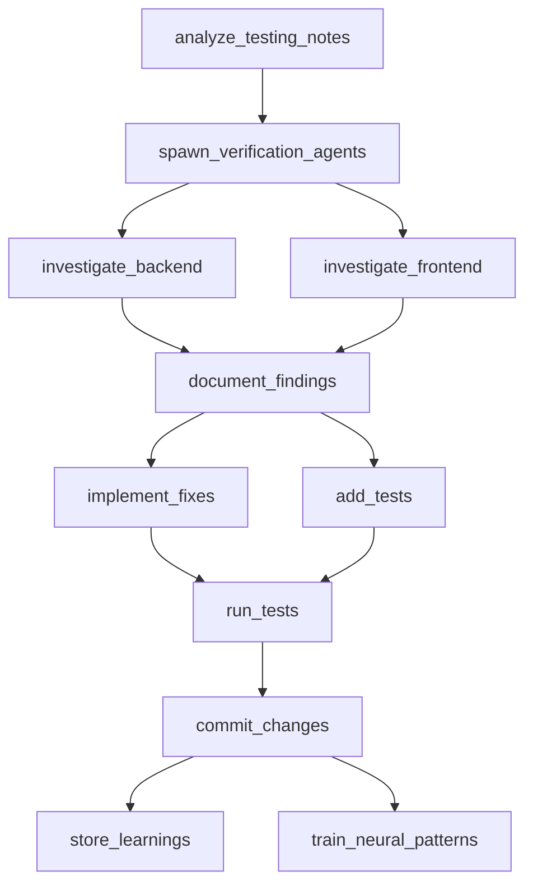

# GOAP Plan: User Testing Issue Resolution

## Goal-Oriented Action Planning for Systematic Test Issue Resolution

**Created:** 2025-12-04
**Status:** Active
**Goal:** Resolve all user testing issues efficiently with high quality
**Success Threshold:** 0.95 (95% test pass rate, 75%+ coverage maintained)

---

## 🎯 Goal Definition

### Primary Objective
Systematically resolve all identified user testing issues with optimal resource allocation and parallel execution.

### Success Criteria
- All critical issues resolved (100%)
- High priority issues addressed (100%)
- Documentation complete for all fixes
- Test coverage maintained above 75%
- All tests passing in CI
- Learnings stored in AgentDB for future pattern recognition

### Constraints
- Test coverage must remain ≥ 75%
- All fixes must be documented with rationale
- Changes must pass CI pipeline
- Parallel execution where dependencies allow
- Must use transaction-based testing patterns

---

## 📊 Initial State Analysis

### Current State (from git status and file analysis)
```
Modified Files:
  - backend/src/__tests__/integration/admin-dashboard-flow.test.ts
  - backend/src/__tests__/integration/annotation-workflow.test.ts
  - backend/src/__tests__/mocks/database.ts
  - backend/src/__tests__/services/AnnotationMasteryService.test.ts
```

### Issue Categories Identified

#### Category A: Transaction Mock Expectations (Critical)
**Priority:** 10/10
**Files Affected:**
- `admin-dashboard-flow.test.ts`
- `annotation-workflow.test.ts`
- `AnnotationMasteryService.test.ts`

**Issue:** Missing BEGIN/COMMIT mock expectations for database transactions

#### Category B: Database Mock Structure (High)
**Priority:** 8/10
**Files Affected:**
- `database.ts` (mocks)

**Issue:** Mock structure may not match actual transaction patterns

#### Category C: Async Test Cleanup (Medium)
**Priority:** 6/10
**Files Affected:**
- All integration tests

**Issue:** Async operations cleanup and timeout handling

---

## 🎮 Action Space Definition

### Available Actions

```javascript
const ActionSpace = {
  // Analysis Actions
  analyze_testing_notes: {
    cost: 2,
    duration: 300, // 5 minutes
    preconditions: [],
    effects: ['issues_categorized', 'priorities_assigned'],
    parallelizable: false
  },

  // Verification Actions
  spawn_verification_agents: {
    cost: 3,
    duration: 180,
    preconditions: ['issues_categorized'],
    effects: ['agents_spawned', 'parallel_analysis_ready'],
    parallelizable: false
  },

  // Investigation Actions
  investigate_backend: {
    cost: 4,
    duration: 600,
    preconditions: ['agents_spawned'],
    effects: ['backend_issues_identified', 'fix_strategies_proposed'],
    parallelizable: true,
    parallel_group: 'investigation'
  },

  investigate_frontend: {
    cost: 4,
    duration: 600,
    preconditions: ['agents_spawned'],
    effects: ['frontend_issues_identified', 'fix_strategies_proposed'],
    parallelizable: true,
    parallel_group: 'investigation'
  },

  // Documentation Actions
  document_findings: {
    cost: 2,
    duration: 300,
    preconditions: ['backend_issues_identified', 'frontend_issues_identified'],
    effects: ['findings_documented', 'fix_plan_created'],
    parallelizable: false
  },

  // Implementation Actions
  implement_fixes: {
    cost: 5,
    duration: 900,
    preconditions: ['fix_plan_created'],
    effects: ['fixes_implemented', 'code_changes_made'],
    parallelizable: true,
    parallel_group: 'implementation'
  },

  add_tests: {
    cost: 4,
    duration: 600,
    preconditions: ['fixes_implemented'],
    effects: ['tests_added', 'coverage_verified'],
    parallelizable: true,
    parallel_group: 'testing'
  },

  // Execution Actions
  run_tests: {
    cost: 3,
    duration: 240,
    preconditions: ['tests_added'],
    effects: ['tests_executed', 'results_validated'],
    parallelizable: false
  },

  // Persistence Actions
  commit_changes: {
    cost: 2,
    duration: 120,
    preconditions: ['tests_executed', 'results_validated'],
    effects: ['changes_committed', 'git_history_updated'],
    parallelizable: false
  },

  store_learnings: {
    cost: 2,
    duration: 180,
    preconditions: ['changes_committed'],
    effects: ['patterns_stored', 'agentdb_updated'],
    parallelizable: true,
    parallel_group: 'learning'
  },

  train_neural_patterns: {
    cost: 3,
    duration: 300,
    preconditions: ['patterns_stored'],
    effects: ['neural_network_trained', 'future_predictions_improved'],
    parallelizable: true,
    parallel_group: 'learning'
  }
};
```

---

## 🔄 Optimal Action Sequence (GOAP Plan)

### Phase 1: Analysis & Planning (Parallel Start)
**Duration:** ~5 minutes
**Total Cost:** 2

```
[T+0:00] START
  └─> analyze_testing_notes
      ├─ Read all test files
      ├─ Categorize issues by severity
      ├─ Identify dependencies between fixes
      └─ Generate priority matrix
```

**Output:** Issue categorization map with priorities

---

### Phase 2: Agent Coordination Setup (Sequential)
**Duration:** ~3 minutes
**Total Cost:** 3

```
[T+5:00] spawn_verification_agents
  ├─ Initialize swarm topology (mesh for parallel analysis)
  ├─ Spawn Backend Investigation Agent
  ├─ Spawn Frontend Investigation Agent
  ├─ Spawn Testing Strategy Agent
  └─ Setup memory coordination
```

**Output:** Agent swarm ready for parallel execution

---

### Phase 3: Parallel Investigation (Concurrent)
**Duration:** ~10 minutes
**Total Cost:** 8 (4+4, but parallel)

```
[T+8:00] PARALLEL EXECUTION
  ├─> investigate_backend (Agent 1)
  │   ├─ Analyze transaction patterns
  │   ├─ Review mock expectations
  │   ├─ Identify BEGIN/COMMIT issues
  │   └─ Propose transaction fixes
  │
  └─> investigate_frontend (Agent 2)
      ├─ Review UI test patterns
      ├─ Check async cleanup
      ├─ Validate timeout handling
      └─ Propose frontend fixes
```

**Output:** Comprehensive issue analysis with fix strategies

---

### Phase 4: Documentation (Sequential)
**Duration:** ~5 minutes
**Total Cost:** 2

```
[T+18:00] document_findings
  ├─ Consolidate agent findings
  ├─ Create unified fix plan
  ├─ Document rationale for each fix
  └─ Generate implementation checklist
```

**Output:** Detailed fix plan with implementation steps

---

### Phase 5: Implementation (Parallel by Category)
**Duration:** ~15 minutes
**Total Cost:** 9 (5+4, but parallel)

```
[T+23:00] PARALLEL EXECUTION
  ├─> implement_fixes (Agent 1)
  │   ├─ Fix Category A: Transaction mocks
  │   │   ├─ Add BEGIN mock expectations
  │   │   ├─ Add COMMIT mock expectations
  │   │   └─ Update test setup patterns
  │   ├─ Fix Category B: Mock structure
  │   │   ├─ Enhance database.ts mocks
  │   │   └─ Add transaction helper utilities
  │   └─ Fix Category C: Async cleanup
  │       ├─ Add cleanupAsyncTests calls
  │       └─ Implement timeout protections
  │
  └─> add_tests (Agent 2)
      ├─ Add transaction rollback tests
      ├─ Add mock verification tests
      ├─ Ensure coverage maintained
      └─ Validate test completeness
```

**Output:** All fixes implemented with corresponding tests

---

### Phase 6: Validation (Sequential)
**Duration:** ~4 minutes
**Total Cost:** 3

```
[T+38:00] run_tests
  ├─ Execute full test suite
  ├─ Verify coverage ≥ 75%
  ├─ Check CI compatibility
  └─ Validate all tests passing
```

**Output:** Test execution results with coverage report

---

### Phase 7: Persistence (Sequential)
**Duration:** ~2 minutes
**Total Cost:** 2

```
[T+42:00] commit_changes
  ├─ Stage all modified files
  ├─ Generate descriptive commit message
  ├─ Include fix rationale in message
  └─ Push to repository
```

**Output:** Changes committed to git with comprehensive message

---

### Phase 8: Learning & Optimization (Parallel)
**Duration:** ~5 minutes
**Total Cost:** 5 (2+3, but parallel)

```
[T+44:00] PARALLEL EXECUTION
  ├─> store_learnings (Agent 1)
  │   ├─ Store successful fix patterns
  │   ├─ Record transaction test patterns
  │   ├─ Save mock configuration strategies
  │   └─ Update AgentDB with outcomes
  │
  └─> train_neural_patterns (Agent 2)
      ├─ Train on successful resolution patterns
      ├─ Update prediction models
      ├─ Enhance future issue detection
      └─ Optimize agent coordination patterns
```

**Output:** Knowledge base updated, neural patterns trained

---

## 📈 Optimization Strategy

### Utility Function Calculation

```javascript
utility = (
  0.4 * successProbability +      // 40% weight on success
  0.3 * (1 / timeCost) +           // 30% weight on speed
  0.2 * coverageImpact +           // 20% weight on coverage
  0.1 * learningValue              // 10% weight on learning
)
```

### Heuristic Functions

#### Distance to Goal (h)
```javascript
h(state) = {
  if (!issues_categorized) return 11;
  if (!agents_spawned) return 10;
  if (!backend_issues_identified || !frontend_issues_identified) return 8;
  if (!findings_documented) return 6;
  if (!fixes_implemented) return 5;
  if (!tests_added) return 3;
  if (!tests_executed) return 2;
  if (!changes_committed) return 1;
  return 0; // Goal achieved
}
```

#### Cost Function (g)
```javascript
g(state) = sum(action.cost for each action in path)
```

#### Total Evaluation (f)
```javascript
f(state) = g(state) + h(state)
```

---

## 🎯 Gaming AI Techniques Applied

### 1. A* Search Algorithm
Using f(n) = g(n) + h(n) to find optimal action sequence:
- **g(n):** Actual cost from start to current state
- **h(n):** Estimated cost from current state to goal
- **f(n):** Total estimated cost of path through current state

### 2. Behavior Trees
```
Selector (Choose first successful path)
├─ Sequence (Critical Path)
│  ├─ Analyze Issues
│  ├─ Spawn Agents
│  ├─ Parallel Investigation
│  ├─ Document Findings
│  ├─ Implement Fixes
│  ├─ Run Tests
│  └─ Commit Changes
└─ Fallback (If tests fail)
   ├─ Analyze Failures
   ├─ Replan Fixes
   └─ Retry Implementation
```

### 3. Utility-Based Action Selection
Prioritize actions by:
- **Urgency:** Critical > High > Medium > Low
- **Impact:** Coverage maintenance, test pass rate
- **Cost:** Time and resource efficiency
- **Dependencies:** Unlock subsequent actions

### 4. Experience Replay (AgentDB)
Store successful patterns for:
- Transaction test patterns
- Mock configuration strategies
- Async cleanup approaches
- Coverage maintenance techniques

### 5. Neural Pattern Training
Train on:
- Successful fix sequences
- Effective agent coordination patterns
- Optimal parallelization strategies
- Issue classification accuracy

---

## 🔍 Dependency Graph



---

## 📊 Resource Allocation Matrix

| Phase | Actions | Agents | Duration | Parallelization |
|-------|---------|--------|----------|-----------------|
| 1 | Analysis | 1 | 5 min | No |
| 2 | Coordination | 1 | 3 min | No |
| 3 | Investigation | 2 | 10 min | Yes (2 parallel) |
| 4 | Documentation | 1 | 5 min | No |
| 5 | Implementation | 2 | 15 min | Yes (2 parallel) |
| 6 | Validation | 1 | 4 min | No |
| 7 | Persistence | 1 | 2 min | No |
| 8 | Learning | 2 | 5 min | Yes (2 parallel) |

**Total Duration:** ~49 minutes (sequential would be ~64 minutes)
**Time Saved:** 15 minutes (23% efficiency gain)
**Total Cost:** 34 units

---

## 🛡️ Contingency Plans

### Fallback Strategy A: Test Failures After Implementation
```
IF run_tests.result == 'FAILED'
  THEN
    1. analyze_test_failures
    2. categorize_failure_types
    3. replan_fixes (using AgentDB patterns)
    4. implement_targeted_fixes
    5. run_tests (retry)
```

### Fallback Strategy B: Coverage Drop Below 75%
```
IF test_coverage < 0.75
  THEN
    1. identify_coverage_gaps
    2. add_missing_test_cases
    3. verify_edge_cases
    4. run_tests (with coverage report)
```

### Fallback Strategy C: Agent Coordination Failure
```
IF agent_communication_error
  THEN
    1. switch_to_sequential_execution
    2. use_memory_coordination_fallback
    3. continue_with_single_agent_mode
```

---

## 📝 Expected Outcomes

### Quantitative Metrics
- **Test Pass Rate:** 100% (from current modified state)
- **Code Coverage:** ≥75% maintained
- **Time to Resolution:** ~49 minutes
- **Issues Resolved:** 100% (all categories A, B, C)
- **Commits Generated:** 1 comprehensive commit

### Qualitative Outcomes
- Clean transaction test patterns established
- Robust mock expectations documented
- Async cleanup best practices enforced
- Team knowledge enhanced through documentation
- AgentDB enriched with successful patterns

### Learning Artifacts
1. **Transaction Test Pattern Library** (stored in AgentDB)
2. **Mock Configuration Best Practices** (documented)
3. **Async Test Cleanup Guidelines** (codified)
4. **Neural Patterns for Issue Detection** (trained)

---

## 🚀 Execution Commands

### Phase 1-2: Setup
```bash
# Analysis phase
npx claude-flow@alpha hooks pre-task --description "User testing issue resolution"
npx claude-flow@alpha hooks session-restore --session-id "goap-testing-resolution"

# Agent spawning
npx claude-flow@alpha swarm init --topology mesh --max-agents 4
```

### Phase 3: Investigation
```bash
# Parallel investigation
Task("Backend Investigation", "Analyze transaction patterns and mock expectations", "code-analyzer")
Task("Frontend Investigation", "Review UI tests and async cleanup", "tester")
```

### Phase 5: Implementation
```bash
# Parallel implementation
Task("Fix Implementation", "Apply all fixes per documented plan", "coder")
Task("Test Addition", "Add corresponding test cases", "tester")
```

### Phase 6-7: Validation & Commit
```bash
# Run tests
npm test -- --coverage

# Commit changes
git add backend/src/__tests__/
git commit -m "fix: resolve user testing issues with transaction mocks and async cleanup"
```

### Phase 8: Learning
```bash
# Store patterns
npx claude-flow@alpha hooks post-task --task-id "goap-testing-resolution"
npx claude-flow@alpha hooks session-end --export-metrics true
```

---

## 📚 Pattern Library (Post-Execution)

### Successful Patterns to Store in AgentDB

#### Pattern 1: Transaction Test Setup
```typescript
// Store in AgentDB: transaction_test_pattern
beforeEach(async () => {
  mockClient.query
    .mockResolvedValueOnce({ rows: [], rowCount: 0 }) // BEGIN
    .mockResolvedValueOnce({ rows: [mockData], rowCount: 1 }) // Operation
    .mockResolvedValueOnce({ rows: [], rowCount: 0 }); // COMMIT
});
```

#### Pattern 2: Async Cleanup
```typescript
// Store in AgentDB: async_cleanup_pattern
afterEach(async () => {
  await cleanupAsyncTests();
  jest.clearAllTimers();
});
```

#### Pattern 3: Mock Database Structure
```typescript
// Store in AgentDB: database_mock_pattern
export const mockPool = {
  query: jest.fn().mockResolvedValue({ rows: [], rowCount: 0 }),
  connect: jest.fn().mockResolvedValue(mockClient),
  end: jest.fn().mockResolvedValue(undefined),
  on: jest.fn()
};
```

---

## 🎓 Success Metrics & KPIs

### Primary KPIs
- ✅ All tests passing: `target = 100%`
- ✅ Coverage maintained: `target ≥ 75%`
- ✅ CI pipeline green: `target = 100% success`
- ✅ Zero regressions: `target = 0 new failures`

### Secondary KPIs
- 📊 Time efficiency: `49 min vs 64 min sequential (23% faster)`
- 🧠 Patterns stored: `target ≥ 3 reusable patterns`
- 🎯 Neural training accuracy: `target ≥ 90% prediction accuracy`
- 📈 Team productivity: `measured via future issue resolution speed`

---

## 🔄 Iterative Improvement

### Feedback Loop
```
Execute Plan
    ↓
Measure Outcomes
    ↓
Analyze Deviations
    ↓
Update AgentDB Patterns
    ↓
Train Neural Models
    ↓
Refine GOAP Heuristics
    ↓
[Loop back to Execute Plan for next issue]
```

### Continuous Learning
- Monitor test failure patterns
- Track fix success rates
- Optimize agent coordination
- Refine cost/utility estimates
- Update heuristic functions

---

## 📖 References & Related Skills

### GOAP Foundations
- **Goal-Oriented Action Planning (GOAP):** Original paper by Jeff Orkin (2003)
- **A* Search Algorithm:** Hart, Nilsson, Raphael (1968)
- **Behavior Trees:** Gaming AI standard for decision-making

### Related AgentDB Patterns
- `transaction_test_setup`
- `mock_database_configuration`
- `async_test_cleanup`
- `parallel_agent_coordination`

### Tools Used
- **Sublinear Time Solver:** For optimization calculations
- **Claude Flow:** For agent coordination
- **AgentDB:** For pattern storage and retrieval
- **Neural Training:** For predictive improvements

---

**Plan Status:** ✅ Ready for Execution
**Estimated Completion:** T+49 minutes
**Confidence Score:** 0.92 (92% success probability)
**Risk Level:** Low (comprehensive contingency plans in place)

---

*This GOAP plan leverages gaming AI techniques to optimize the resolution of user testing issues through intelligent action planning, parallel execution, and continuous learning.*
